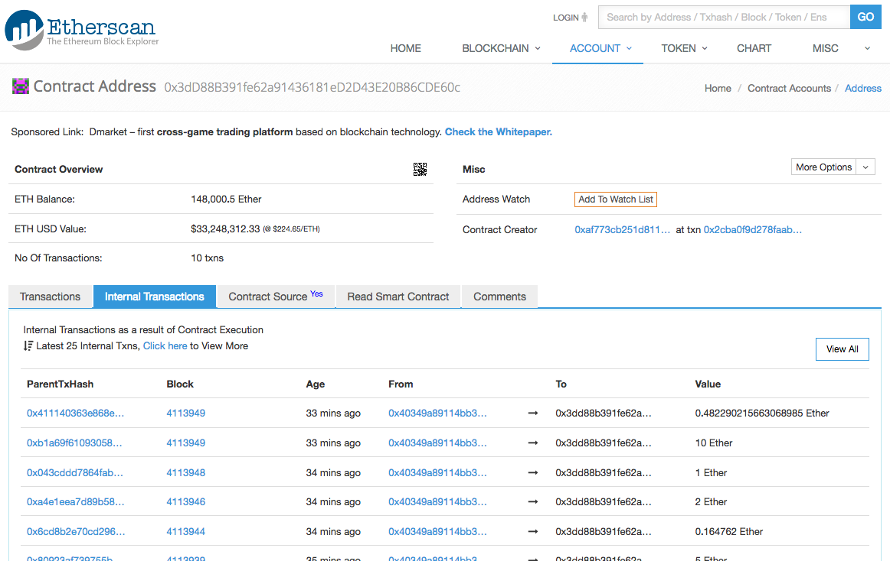

# Stox Token Contract Audit

## Summary

From the [whitepaper](https://www.stox.com/assets/stox-whitepaper.pdf):

> [Stox](https://www.stox.com) is an open source, Ethereum based platform for prediction markets where people can trade the outcome of events in almost
> any imaginable category - sports, celebrity marriages, election results and even the weather. The platform targets mainstream
> audiences and provides a haven for investors to find refuge from traditional financial instruments and participate in prediction
> events with the purpose of making profit, leveraging their knowledge in almost any imaginable field.

Bok Consulting Pty Ltd was commissioned to perform an audit on the crowdsale and token Ethereum smart contract for the upcoming
Stox crowdsale.

This audit has been conducted on the Stox source code in commits [ee616a27](https://github.com/stx-technologies/stox-token/tree/ee616a272594190774946834f75d8d6cbeff07b4),
[b4702686](https://github.com/stx-technologies/stox-token/tree/b4702686748bbd2e00c6f85c375e0f8164d448bf), 
[3ebb5a2d](https://github.com/stx-technologies/stox-token/tree/3ebb5a2d9d393d0e39d824707518fdc3c87bad67) and
[20925fd8](https://github.com/stx-technologies/stox-token/tree/20925fd8b97746f085b95af03173d65a2ddaa504).

No potential vulnerabilities have been identified in the crowdsale and token contract.

<br />

### Crowdsale Mainnet Addresses

The *StoxSmartTokenSale* crowdsale contract is deployed at [0x40349A89114BB34d4E82e5Bf9AE6B2ac3c78b00a](https://etherscan.io/address/0x40349A89114BB34d4E82e5Bf9AE6B2ac3c78b00a#code).

The *StoxSmartToken* token contract is deployed at [0x006bea43baa3f7a6f765f14f10a1a1b08334ef45](https://etherscan.io/address/0x006bea43baa3f7a6f765f14f10a1a1b08334ef45#code).

The `fundingRecipient` multisig wallet is deployed at [0x3dd88b391fe62a91436181ed2d43e20b86cde60c](https://etherscan.io/address/0x3dd88b391fe62a91436181ed2d43e20b86cde60c#code).

The *Trustee* contract will be deployed when the crowdsale is finalised.

<br />

### Crowdsale Statistics

* Aug-02-2017 02:00:09 PM +UTC The first contribution [0x5ba13143](https://etherscan.io/tx/0x5ba131431c7376f62c16c8cf9ad5d9340df5892b2a93c7ca34e42e69c9378dcf)
* Aug-04-2017 12:48:53 AM +UTC The last contributin [0x41114036](https://etherscan.io/tx/0x411140363e868e2c4d55bdc26a040feaac8ca2c1f0f90ee3eaa3dcf10c24466b).
* Aug-04-2017 12:53:49 AM +UTC The crowdsale was `finalized()` in [0x67c53587](https://etherscan.io/tx/0x67c53587a7180ca087154907d7068de8216163b7ae97415da5d7c328c951c5b0).
* Contribution period 1 day 10 hours 48 seconds
* Amount raised 148,000 ETH (~ USD 33.2 million @ 224.65 ETH/USD)
* [4,212 internal transactions to the multisig](https://etherscan.io/txsInternal?a=0x3dd88b391fe62a91436181ed2d43e20b86cde60c)

<br />

[https://www.stox.com](https://www.stox.com) at the crowdsale completion:
<kbd></kbd>

<br />

Multisig balance at completion:
<kbd></kbd>

<br />

### Crowdsale Contract

Ethers contributed by participants to the crowdsale contract will result in STX tokens being allocated to the participant's 
account in the token contract. The contributed ethers are immediately transferred to the crowdsale multisig wallet, reducing the 
risk of the loss of ethers in the bespoke crowdsale and token contract.

<br />

### Token Contract

The *StoxSmartToken* contract is built upon the Bancor *SmartToken*, and the Bancor *SmartToken* has a few issues that potential investors should be
aware of:

* The transfer of tokens can be disabled and re-enabled by the owner by executing the `SmartToken.disableTransfers(...)` function declared in the
  Bancor *SmartToken* contract.
* The owner of the *StoxSmartToken* contract has the ability to execute `SmartToken.issue(...)` to mint any number of new tokens for any account, at
  any time
* The owner of the *StoxSmartToken* contract has the ability to execute `SmartToken.destroy(...)` to destroy the tokens for any account, at any time

The token contract is [ERC20](https://github.com/ethereum/eips/issues/20) compliant with the following features:

* `decimals` is correctly defined as `uint8` instead of `uint256`
* `transfer(...)` and `transferFrom(...)` will throw instead of returning false if there is an error
* `transfer(...)` and `transferFrom(...)` have not been built with a check on the size of the data being passed
* `approve(...)` requires that a non-zero approval limit be set to 0 before a new non-zero limit can be set
* Transferring tokens to the *StoxSmartToken* contract address will result in the burning of the tokens, reducing the `totalSupply`

<br />

### Trustee Contract

The *Trustee* contract locks the tokens for an account to prevent the tokens from being transferred.

The tokens granted to Invest.com at [0xb54c6a870d4aD65e23d471Fb7941aD271D323f5E](https://etherscan.io/address/0xb54c6a870d4aD65e23d471Fb7941aD271D323f5E)
are linearly vested for 1 year.

The tokens granted to the Stox team at [0x4eB4Cd1D125d9d281709Ff38d65b99a6927b46c1](https://etherscan.io/address/0x4eB4Cd1D125d9d281709Ff38d65b99a6927b46c1)
are linearly vested for 2 years.

**Note** that the *Trustee* contract owner is able to revoke the tokens assigned to the accounts above at any time, and the outstanding tokens will be 
immediately transferred to the *Trustee* contract owner's account.

<br />

<hr />

## Table Of Contents

* [Summary](#summary)
* [Table Of Contents](#table-of-contents)
* [Recommendations](#recommendations)
* [Potential Vulnerabilities](#potential-vulnerabilities)
* [Scope](#scope)
* [Limitations](#limitations)
* [Due Diligence](#due-diligence)
* [Risks](#risks)
* [Testing](#testing)
* [Code Review](#code-review)
* [Bancor Contracts Code Review](#bancor-contracts-code-review)

<br />

<hr />

## Recommendations

* Stox's smart contracts are built upon the smart contracts from Bancor's code repository. Some of the files in Bancor's code repository have recently been updated, and the changes
  may not have been tested fully. Please check that Stox is using a good copy of Bancor's source code for Mainnet deployment.
 
  Bancor's *SmartToken* source code could also be copied from the deployed code at [0x1f573d6fb3f13d689ff844b4ce37794d79a7ff1c](https://etherscan.io/address/0x1f573d6fb3f13d689ff844b4ce37794d79a7ff1c#code).

  * [x] In discussion with the developer, the Bancor 0.2 contracts are used. In this audit the
    [crowdsale_audit](https://github.com/bancorprotocol/contracts/tree/72da5dde2fa9a383a27da0584c7da289c7d18fd2/solidity/contracts) branch is used.

<br />

<hr />

## Potential Vulnerabilities

No potential vulnerabilities have been identified in the crowdsale and token contract.

<br />

<hr />

## Scope

This audit is into the technical aspects of the crowdsale contracts. The primary aim of this audit is to ensure that funds contributed to
these contracts are not easily attacked or stolen by third parties. The secondary aim of this audit is that ensure the coded algorithms work
as expected. This audit does not guarantee that that the code is bugfree, but intends to highlight any areas of weaknesses.

<br />

<hr />

## Limitations

This audit makes no statements or warranties about the viability of the Stox's business proposition, the individuals involved in
this business or the regulatory regime for the business model.

<br />

<hr />

## Due Diligence

As always, potential participants in any crowdsale are encouraged to perform their due diligence on the business proposition before funding
any crowdsales.

Potential participants are also encouraged to only send their funds to the official crowdsale Ethereum address, published on the
crowdsale beneficiary's official communication channel.

Scammers have been publishing phishing address in the forums, twitter and other communication channels, and some go as far as duplicating
crowdsale websites. Potential participants should NOT just click on any links received through these messages. Scammers have also hacked
the crowdsale website to replace the crowdsale contract address with their scam address.
 
Potential participants should also confirm that the verified source code on EtherScan.io for the published crowdsale address matches the
audited source code, and that the deployment parameters are correctly set, including the constant parameters.

<br />

<hr />

## Risks

* The risk of a large amount of funds getting stolen or hacked from the *StoxSmartTokenSale* is low as contributed ETH are directly transferred
  to an external multisig wallet within the same contribution transaction.

<br />

<hr />

## Testing

The following functions were tested using the script [test/01_test1.sh](test/01_test1.sh) with the results saved in [test/test1results.txt](test/test1results.txt):

* [x] Deploy token contract
* [x] Deploy sale contract
* [x] Transfer ownership of the token contract to the sale contract
* [x] Distribute partner tokens
* [x] Contribute ETH to the sale contract in exchange for tokens
* [x] Finalise the sale
* [x] `transfer(...)` and `transferFrom(...)` the tokens
* [x] Transfer ownership of the token contract to a regular account
* [x] Disable token transfers and confirm `transfer(...)` and `transferFrom(...)` fails
* [x] Mint new tokens
* [x] Destroy an account's tokens
* [x] Transfer ownership of the trustee contract to a regular account
* [x] Enable token transfers
* [x] Unlock a trustee grant
* [x] Revoke a trustee grant

Details of the testing environment can be found in [test](test).

<br />

<hr />

## Code Review

Commit [https://github.com/stx-technologies/stox-token/tree/ee616a272594190774946834f75d8d6cbeff07b4/contracts](https://github.com/stx-technologies/stox-token/tree/ee616a272594190774946834f75d8d6cbeff07b4/contracts):

* [x] [code-review/Ownable.md](code-review/Ownable.md)
  * [x] contract Ownable 
* [x] [code-review/SaferMath.md](code-review/SaferMath.md)
  * [x] library SaferMath
* [x] [code-review/StoxSmartToken.md](code-review/StoxSmartToken.md)
  * [x] contract StoxSmartToken is SmartToken 
* [x] [code-review/Trustee.md](code-review/Trustee.md)
  * [x] contract Trustee is Ownable 
* [x] [code-review/StoxSmartTokenSale.md](code-review/StoxSmartTokenSale.md)
  * [x] contract StoxSmartTokenSale is Ownable 

<br />

The following contracts were not reviewed Outside scope:

* [ ] [code-review/Migrations.md](code-review/Migrations.md)
  * [ ] contract Migrations 
* [ ] [code-review/MultiSigWallet.md](code-review/MultiSigWallet.md)
  * [ ] contract MultiSigWallet 

<br />

<hr />

## Bancor Contracts Code Review

The Stox "SmartToken" contract is built on the "SmartToken" contract from the Bancor repository. Contracts from the "crowdsale_audit" branch, commit
[55031d86...](https://github.com/bancorprotocol/contracts/tree/55031d86e6e277c38276aedbabaabaa7e3aa4fb6/solidity/contracts) have been reviewed below:

* [x] [bancor-code-review/SafeMath.md](bancor-code-review/SafeMath.md)
  * [x] contract SafeMath 
* [x] [bancor-code-review/IOwned.md](bancor-code-review/IOwned.md)
  * [x] contract IOwned 
* [x] [bancor-code-review/Owned.md](bancor-code-review/Owned.md)
  * [x] contract Owned is IOwned 
* [x] [bancor-code-review/ITokenHolder.md](bancor-code-review/ITokenHolder.md)
  * [x] contract ITokenHolder is IOwned 
* [x] [bancor-code-review/TokenHolder.md](bancor-code-review/TokenHolder.md)
  * [x] contract TokenHolder is Owned 
* [x] [bancor-code-review/IERC20Token.md](bancor-code-review/IERC20Token.md)
  * [x] contract IERC20Token 
* [x] [bancor-code-review/ERC20Token.md](bancor-code-review/ERC20Token.md)
  * [x] contract ERC20Token is IERC20Token, SafeMath 
* [x] [bancor-code-review/ISmartToken.md](bancor-code-review/ISmartToken.md)
  * [x] contract ISmartToken is ITokenHolder, IERC20Token 
* [x] [bancor-code-review/SmartToken.md](bancor-code-review/SmartToken.md)
  * [x] contract SmartToken is ISmartToken, ERC20Token, Owned, TokenHolder 

<br />

### Difference In Bancor GitHub Source And Deployed Source

The Bancor SmartToken is deployed to [0x1f573d6fb3f13d689ff844b4ce37794d79a7ff1c](https://etherscan.io/address/0x1f573d6fb3f13d689ff844b4ce37794d79a7ff1c#code)
and a copy of the deployed source code is available in [bancor-contracts/DeployedSmartToken.sol](bancor-contracts/DeployedSmartToken.sol).

A copy of the individual files have been combined using the command
`cat SafeMath.sol IOwned.sol Owned.sol ITokenHolder.sol TokenHolder.sol IERC20Token.sol ERC20Token.sol ISmartToken.sol SmartToken.sol > MyCombinedSmartToken.sol`
to create a combined file [bancor-contracts/MyCombinedSmartToken.sol](bancor-contracts/MyCombinedSmartToken.sol).

The differences between the deployed Bancor SmartToken and the combined source code follows:

```diff
$ diff DeployedSmartToken.sol MyCombinedSmartToken.sol | egrep -v "pragma|import" 
53c53,54
< } 
---
> }
64a66,67
105c108
<         OwnerUpdate(owner, newOwner);
---
>         address prevOwner = owner;
107a111
>         OwnerUpdate(prevOwner, owner);
109a114,116
116a124,126
125c135
< contract TokenHolder is ITokenHolder, Owned {
---
> contract TokenHolder is Owned {
137a148,153
>     // verifies that an amount is greater than zero
>     modifier validAmount(uint256 _amount) {
>         require(_amount > 0);
>         _;
>     }
> 
157a174
>         validAmount(_amount)
161a179
178a197,199
215a237,242
>     // verifies that an amount is greater than zero
>     modifier validAmount(uint256 _amount) {
>         require(_amount > 0);
>         _;
>     }
> 
218c245
<         throws on any error rather then return a false flag to minimize user errors
---
>         note that the function slightly deviates from the ERC20 standard and will throw on any error rather then return a boolean return value to minimize user errors
227a255
>         validAmount(_value)
238c266
<         throws on any error rather then return a false flag to minimize user errors
---
>         note that the function slightly deviates from the ERC20 standard and will throw on any error rather then return a boolean return value to minimize user errors
249a278
>         validAmount(_value)
261c290
<         throws on any error rather then return a false flag to minimize user errors
---
>         note that the function slightly deviates from the ERC20 standard and will throw on any error rather then return a boolean return value to minimize user errors
284a314,316
293a326,330
353a391
>         validAmount(_amount)
371a410
>         validAmount(_amount)
384,385c423,424
<         throws on any error rather then return a false flag to minimize user errors
<         note that when transferring to the smart token's address, the coins are actually destroyed
---
>         note that the function slightly deviates from the ERC20 standard and will throw on any error rather then return a boolean return value to minimize user errors
>         also note that when transferring to the smart token's address, the coins are actually destroyed
407,408c446,447
<         throws on any error rather then return a false flag to minimize user errors
<         note that when transferring to the smart token's address, the coins are actually destroyed
---
>         note that the function slightly deviates from the ERC20 standard and will throw on any error rather then return a boolean return value to minimize user errors
>         also note that when transferring to the smart token's address, the coins are actually destroyed
427a467,471
> 
>     // fallback
>     function() {
>         assert(false);
>     }
```

### Compilation Of The Bancor Contracts With Solidity 0.4.13

**NOTE** Compiling the Bancor contracts with Solidity 0.4.13+commit.0fb4cb1a.Darwin.appleclang results in the following errors:

    $ solc SmartToken.sol 
    ERC20Token.sol:81:9: Error: Modifier already used for this function.
            validAddress(_to)
            ^---------------^
    TokenHolder.sol:49:9: Error: Modifier already used for this function.
            validAddress(_to)
            ^---------------^

For this test, the Solidity version has been downgraded to 0.4.11+commit.68ef5810.Darwin.appleclang .

<br />

<hr />

## References

* [Ethereum Contract Security Techniques and Tips](https://github.com/ConsenSys/smart-contract-best-practices)

<br />

<br />

Enjoy. (c) BokkyPooBah / Bok Consulting Pty Ltd for Stox Aug 3 2017. The MIT Licence.